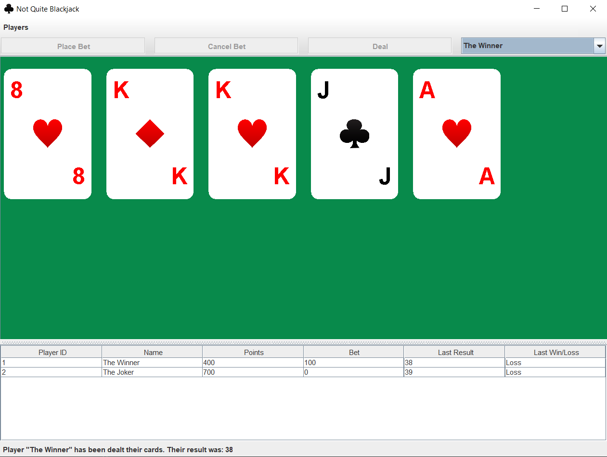

# Not Quite Blackjack

This is a slightly modified version of an assignment I completed at university in 2020. It implements a game similar to blackjack, with some rules modified. It is written in Java and uses AWT/Swing for the GUI.

This project was initially completed in two parts, one with console logging only and the second with the GUI added. It was also originally structured as two separate Eclipse projects that depended upon each other, but I have since combined the projects into one.